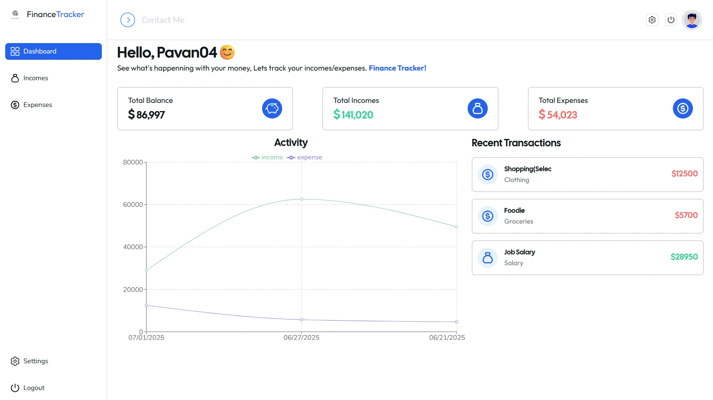

<p align="center">
  
</p>
<h1 align="center">Finance Tracker - Effortless Financial Management</h1>



<h2 align="center">
  <a href="https://finance-tracker-navy-iota.vercel.app/">Explore the Project Live!</a>
</h2>

<hr/>

Finance Tracker is your go-to platform for effortless financial management. Track expenses, manage income, and stay on top of your finances with ease. Easily add transactions, and navigate your dashboard with ease. Take control of your finances with Finance Tracker.

<hr/>

## Table of Contents

- [Features](#features)
- [Installation](#installation)
- [Experience](#experience)
- [License](#license)

<hr>

## Features

Here are some key features of **Finance Tracker** -

- **Expense Tracking**: Easily categorize and monitor your expenses.
- **Income Management**: Seamlessly add and track your income sources.
- **Secure Authentication**: Protect your account with robust authentication.
- **Insightful Reports**: Gain valuable insights into your financial health.
- **Personalized Budgeting**: Set and track customized spending limits.

<hr/>

## Installation

Follow these steps to set up Finance Tracker on your local machine:

### Prerequisites

- Node.js and npm installed on your machine
- MongoDB installed and running locally or accessible via a cloud service
- Git installed on your machine

### Clone the repository:

```bash
https://github.com/PavanSugreev04/Finance_Tracker.git
```

### Make the .env file in backend directory

Create a `.env` file based of `env.example` in the backend directory and save it as .env.

```bash
cd backend
```

#### Example .env file

```bash
# .env.example
PORT=3000
MONGO_URI=mongodb://localhost:8080/finance_tracker
JWT_SECRET_KEY=your_secret_key_here
NODE_ENV=development
ENCRYPTION_SALT=10
EMAIL_USER=your_email@example.com
EMAIL_PASS=your_email_app_password_here
```

### Setup

To install dependencies and start the development servers for both frontend and backend, run the following commands:

1. Install dependencies for both frontend and backend

```bash
npm run setup
```

2. Start the development servers for both frontend and backend

```bash
npm run dev
```

<hr/>

## Experience

During the development of Finance Tracker, I gained valuable experience in several key areas:

- **Full-Stack Development** 💻: I learned how to develop both frontend and backend components of a web application, enabling me to create a seamless user experience from start to finish.
- **React.js** ⚛️: I honed my skills in React.js, leveraging its component-based architecture to build dynamic and interactive user interfaces.
- **Node.js and Express.js** 🚀: I became proficient in using Node.js and Express.js to create a scalable and efficient backend server, handling authentication, data storage, and API endpoints.
- **MongoDB and Mongoose** 🍃: I learned how to work with MongoDB, a NoSQL database, and Mongoose, an object modeling tool, to store and manage data for Spend Smart.
- **User Authentication** 🔒: I implemented secure user authentication using JWT (JSON Web Tokens), ensuring that user data remains protected and accessible only to authorized users.
- **State Management** 🔄: I utilized Redux for state management in the frontend, enabling efficient data flow and ensuring consistency across the application.
- **Deployment** 🚀: I gained experience in deploying web applications, learning how to deploy both the frontend and backend components to cloud platforms like Vercel, Docker.
- **Agile Development** 🔄: I practiced Agile development methodologies throughout the project, including iterative development, continuous integration, and frequent testing.
- **UI/UX Design** 🎨: I focused on creating an intuitive and user-friendly interface for Spend Smart, prioritizing usability and accessibility to enhance the overall user experience.

By working on Finance Tracker, I not only enhanced my technical skills but also gained valuable insights into the process of developing a real-world web application from concept to completion.

<hr/>

## License:

- Finance Tracker is licensed under the [MIT License](LICENSE).

<hr/>

